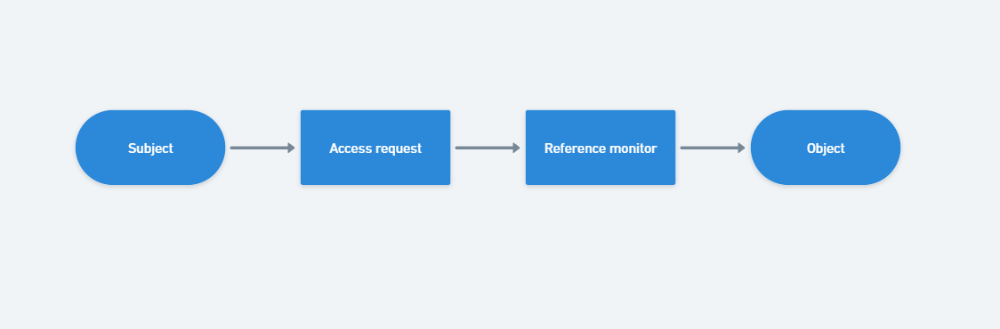

#  Access Control

## Contents
[1. Basic concepts](#1-basic-concepts)

+ [1.1. Access control mechanism](#11-access-control-mechanism)

+ [1.2. Object](#12-object)

+ [1.3. Subject](#13-subject)

+ [1.4. Access Operation - Access Modes](#14-access-operation---access-modes)

[2. DAC và MAC](#2-dac-và-mac)

[3. DAC](#3-dac)

[4. Content-base access control](#4-content-base-access-control)

[5. RBAC](#5-rbac)

## 1. Basic concepts

- access control system điều khiển các operations (hành động/thao tác) thực thi trên data và resources được bảo vệ.

- mục đích là điều khiển các operations được thực thi bởi các subject (chủ thể thực thi hành động) để ngăn chặn các hành động có thể gây hành hưởng xấu tới data (dữ liệu) và resources (tài nguyên).

- Access control (kiểm soát truy cập) là một trong những đặc tính cơ bản được cung cấp bởi các hệ quản trị cơ sở dữ liệu (DBMS). Access control đảm bảo rằng các người dùng chỉ có quyền truy cập và thực hiện các thao tác trên dữ liệu mà họ được phép, giúp bảo vệ tính toàn vẹn, bảo mật và sẵn sàng của dữ liệu. DBMS cung cấp các công cụ và cơ chế để quản lý và thực thi các quyền truy cập, bao gồm xác thực người dùng, quản lý vai trò, phân quyền truy cập dữ liệu, giám sát và ghi lại các hoạt động của người dùng trên hệ thống.

- bản chất của access control chỉ ra những **Subject** yêu cầu truy cập những **Object** để thực hiện những **Operation** nhất định.

- reference monitor grant or denies access.

> **NOTE:** Trong lĩnh vực dữ liệu, "operation" (hoặc "data operation") có thể được hiểu là các hoạt động được thực hiện trên đối tượng dữ liệu được bảo vệ để trích xuất thông tin hữu ích hoặc thay đổi dữ liệu cho mục đích phân tích hoặc sử dụng khác.

### 1.1. Access control mechanism

- là loại hệ thống phần mềm implement(triển khai) access control function.

- thường là một phần của hệ thống khác.

- Access control mechanism dùng các access control policies(chính sách điều khiển truy cập) để quyết định cấp quyền hoặc chặn quyền truy cập của một Subject vào tài nguyên được yêu cầu.

### 1.2. Object

- "object" (đối tượng) là thuật ngữ dùng để chỉ các tài nguyên hoặc thông tin mà một người dùng hoặc một nhóm người dùng muốn truy cập hoặc thực hiện thao tác. Các đối tượng có thể là tập tin, thư mục, cơ sở dữ liệu, ứng dụng, hệ thống, tài khoản người dùng, thiết bị và các thành phần khác trong hệ thống.

- chúng ta thường truy cập đến những object. những thứ được điều khiển bởi access control system, là các object được bảo vệ.

- không phải tất cả các tài nguyên đều cần được bảo vệ.

### 1.3. Subject

- là những người dùng hoặc thực thể mà thực hiện những hành động trên hệ thống

- subject được chia thành các loại sau:
    + user: cá nhân kết nối đến hệ thống
    + groups: nhóm user
    + roles: đại diện cho tập họp nhóm các quyền/ function trong một tổ chức
    + processes: những tiến trình đang thực thi trong hệ thống và yêu cầu truy cập tài nguyên hệ thống.
- relations có thể tồn tại nhiều loại subject

### 1.4. Access Operation - Access Modes

Operation là những thứ hành động subject có thể thực trên các object được bảo vệ trong hệ thống

Mỗi loại operation tương ứng với một access mode

ví dụ về access mode:
    
    read: đọc thông tin của object
    write: thay đổi thông tin của object

Trong thực tế, có rất nhiều access mode

Access mode được hỗ trợ bởi access control mechanism phụ thuộc vào tài nguyên được bảo vệ. có một số loại như sau: read, write, execute, select, insert, update, delete,...
## 2. DAC và MAC
DAC và MAC là hai thuật ngữ trong lĩnh vực bảo mật dữ liệu.

DAC (Discretionary Access Control) là kiểm soát truy cập tùy ý. Theo đó, quyền truy cập được cấp cho người dùng dựa trên quyết định của chủ sở hữu dữ liệu hoặc người quản trị hệ thống. Người dùng được phép chia sẻ dữ liệu với những người khác nếu họ được cấp quyền truy cập.

MAC (Mandatory Access Control) là kiểm soát truy cập bắt buộc. Theo đó, quyền truy cập được cấp dựa trên các chính sách an ninh của hệ thống, chẳng hạn như các quy định của chính phủ hoặc tổ chức. Các người dùng không được phép chia sẻ dữ liệu với những người khác nếu họ không có quyền truy cập tương ứng.
## 3. DAC

## 4. Content-base access control

## 5. RBAC